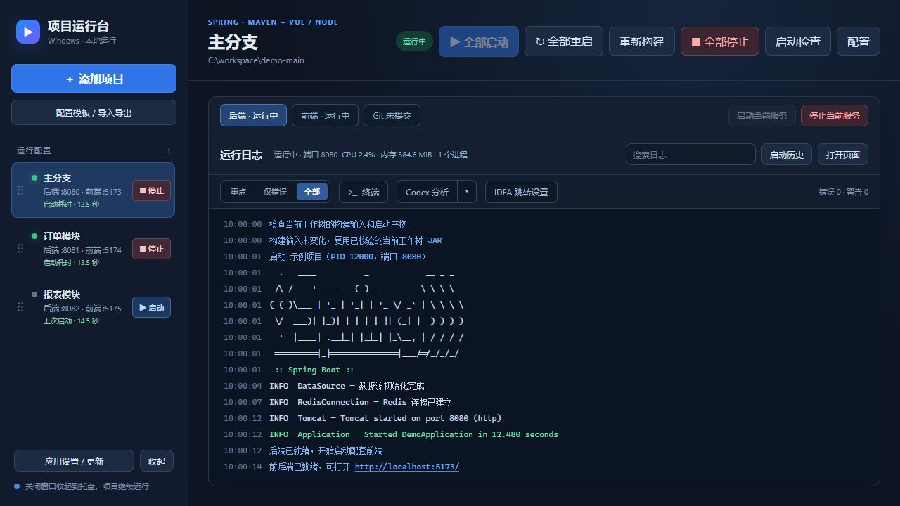
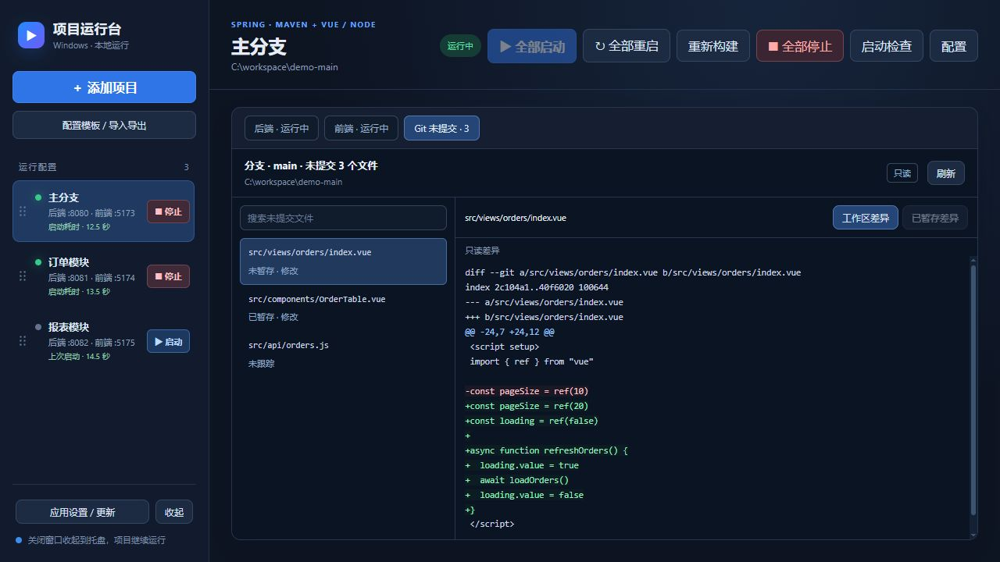

  
  <h1>ProjectRunner · 项目运行台</h1>
  
<strong>把多个工作树的前后端，放进一个运行台。</strong>

  
Windows 本地开发工具 · Spring Boot + Vue / Node · 一组配置，一键启停

  

    
    
    
    
  

  

    <a href="https://github.com/ikMing0/project-runner/releases/latest"><strong>下载 Windows 版</strong></a> ·
    <a href="#快速开始">快速开始</a> ·
    <a href="#功能概览">功能概览</a> ·
    <a href="docs/user-guide.md">使用指南</a> ·
    <a href="docs/development.md">构建与发布</a>
  

---

切换分支后，不必重新拼启动命令、分配端口、找报错日志。ProjectRunner 按工作树保存运行配置，把后端、配套前端、日志、终端和 Git 未提交文件集中在同一个窗口。

**适合同时维护多个 Spring Boot + Vue 项目，或需要并行运行多个分支的本地开发。**

## 界面预览

当前源码的真实界面，使用示例项目与日志；每组前后端可一起启动，也可分别操作。

<strong>查看 Git 未提交文件预览</strong>

只读查看当前分支的已暂存、未暂存、未跟踪及冲突文件，点击文件即可预览差异。

## 功能概览

| 能力 | 能帮你做什么 |
| --- | --- |
| **前后端成组运行** | 一键启动、停止、重启；可等待后端就绪再启动前端，一端失败后补齐启动 |
| **Maven 智能构建** | 未变化时直接复用当前工作树的 JAR；代码变化后构建，删除或重命名后清理构建 |
| **启动检查与诊断** | 检查工具、目录、端口和 MySQL / Redis 等依赖，显示端口占用进程与常见错误建议 |
| **日志与 Codex 分析** | 彩色日志、搜索、重复消息折叠；点击网址打开浏览器，点击编译位置跳转 IDEA |
| **Git 与内置终端** | 只读预览当前工作树的未提交文件；多标签 PowerShell，按服务继承目录和工具环境 |
| **配置复用** | 导入 IDEA 运行配置、复制配置、保存模板；自动建议端口，前端目录跟随后端迁移 |
| **运行状态与历史** | 健康检查、启动耗时、CPU / 内存监控、源码变更提醒、最近运行的脱敏日志 |
| **桌面体验** | 项目拖拽排序、收起到托盘、关闭行为设置、手动检查 GitHub Release 更新 |

完整说明见 [使用指南](docs/user-guide.md)。本文介绍 `main` 分支的能力，下载版本的功能以对应 [Release 说明](https://github.com/ikMing0/project-runner/releases) 为准。

## 快速开始

### 1. 下载并打开

在 [最新 Release](https://github.com/ikMing0/project-runner/releases/latest) 下载 **`ProjectRunner.exe`**，双击运行。使用发布版无需安装 Go 或 Wails。

| 环境 | 要求 |
| --- | --- |
| 操作系统 | Windows 10 / 11 x64；内置终端需要 Windows 10 1809 或更新版本 |
| 界面运行时 | Microsoft Edge WebView2 Runtime |
| Spring Boot 项目 | 项目所需版本的 JDK，以及 Maven / Gradle Wrapper 或本机构建工具 |
| Vue / Node 项目 | Node.js、npm / pnpm / yarn，以及已安装的项目依赖 |

### 2. 添加项目

点击 **「添加项目」**，选择项目或工作树目录。运行台会识别 `pom.xml`、`build.gradle` / `build.gradle.kts` 或 `package.json`，并尝试导入已有 IDEA 运行配置。

确认启动模块、JDK 和构建工具路径。新增或复制配置时，端口会根据历史配置自动建议；你也可以手动修改。

### 3. 配好前端

在后端配置中勾选 **「启用配套前端」**，点击 **「识别配套前端」**，或选择包含 `package.json` 的目录。

下面是一组示例配置：

| 设置 | 后端 | 配套前端 |
| --- | --- | --- |
| 目录 | `C:\workspace\demo` | `C:\workspace\demo\ruoyi-ui` |
| 启动方式 | Spring Boot · Maven | npm · `dev:vite` |
| 模块 | `ruoyi-admin` | — |
| 端口 | `8080` | `5173` |

如果后端启动较慢，可以开启 **「等待后端就绪后再启动前端」**。前端代理地址可自动跟随后端端口，前端代码需要读取配置的代理环境变量。

### 4. 保存并启动

点击 **「保存配置」→「全部启动」**。切换 **「后端 / 前端」** 查看各自日志；遇到错误，先看本地建议，复杂问题可点击 **「Codex 分析」**。

Codex 分析需要本机已安装并登录 Codex CLI，默认使用 `low` 推理强度和只读沙箱，给出根因与解决建议。

## 智能构建如何工作

Maven 启动会先检查当前工作树的构建输入与产物，再选择合适的方式：

| 当前情况 | 启动方式 |
| --- | --- |
| 首次启动、构建记录失效，或 JAR 缺失 / 无效 | `clean package`，成功后启动 |
| 源码或构建输入变化 | 增量 `package`，成功后启动 |
| 源码 / 资源删除或重命名 | `clean package`，清理残留产物后启动 |
| 构建输入未变化，JAR 校验通过 | 直接启动 JAR，跳过 Maven |
| 需要强制更新产物 | 点击 **「重新构建」** |

多模块项目会自动构建启动模块及其依赖，无需手动 `install`。构建失败时不启动旧 JAR；明确的旧产物异常最多自动清理重建一次。

开发启动默认跳过测试；Gradle 项目目前使用 `bootRun`。构建缓存的检查范围、自动恢复条件与限制见 [Maven 启动说明](docs/user-guide.md#maven)。

## 常见问题

<strong>每次启动都需要重新构建吗？</strong>

不需要。Maven 项目在构建输入未变化、记录有效且 JAR 校验通过时，会直接使用当前工作树的产物启动。一般代码变化会增量构建，删除或重命名源码 / 资源则会清理构建。

<strong>前端报代理连接失败怎么办？</strong>

先确认后端是否已就绪，以及前端代理是否指向正确端口。可以开启「等待后端就绪后再启动前端」，避免后端仍在构建或初始化时发起请求。数据库或 Redis 等依赖也可以加入启动检查。

<strong>关闭窗口后，项目还会运行吗？</strong>

默认会停止项目并退出。开启「关闭窗口时收起到托盘」后，关闭窗口会隐藏运行台，项目继续运行；托盘右键「退出并停止所有项目」会结束服务和运行台。

<strong>配置和日志保存在什么地方？</strong>

默认位于 `%AppData%\ProjectRunner\`。项目配置、启动历史、本机模板和工具路径保存在本机，不包含在源码或 Release 中。分享模板会移除绝对工具路径、环境变量和外部配置引用等本机信息。

Codex 分析使用本机 CLI 的登录与提供商，日志快照经常见凭据规则脱敏后交给 CLI；分析内容由所选提供商处理。详细的数据范围见 [本机数据说明](docs/user-guide.md#local-data)。

## 文档与开发

| 文档 | 内容 |
| --- | --- |
| [使用指南](docs/user-guide.md) | IDEA 导入、前后端配对、启动检查、日志、Git、终端、模板和桌面设置 |
| [构建与发布](docs/development.md) | 本地构建、验证命令、GitHub Actions 与 Release 发布流程 |
| [版本下载与更新记录](https://github.com/ikMing0/project-runner/releases) | Windows 可执行文件、SHA256 校验文件与版本说明 |
| [反馈问题](https://github.com/ikMing0/project-runner/issues) | 报告使用问题或提出功能建议；附上脱敏后的日志和复现步骤 |

技术栈：**Go · Wails v2 · WebView2 · JavaScript · xterm.js**。目前专注 Windows 本地开发，支持 Spring Boot（Maven / Gradle）和 Vue / Node 脚本。
